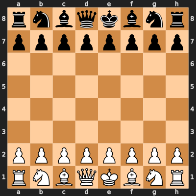
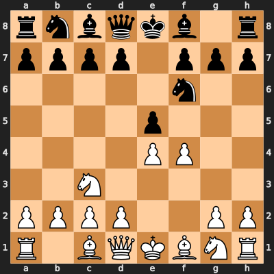
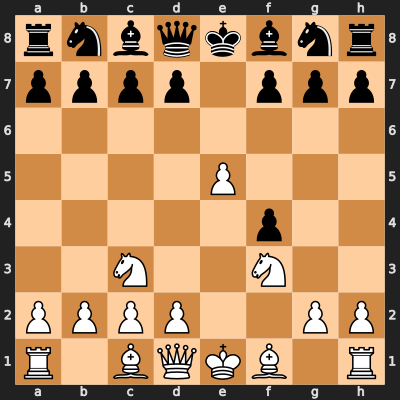
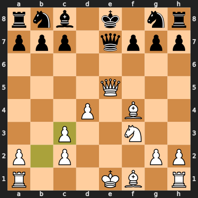
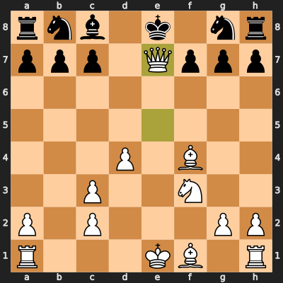

# The White Repertoire: Vienna Gambit Accepted {#sec-white-repertoire}

## Overview

As White, CounterLine plays the **Vienna Gambit Accepted** — an aggressive opening that sacrifices a pawn on f4 to seize the centre and force Black into an awkward retreat. Within 10 moves, White reaches a position with a lasting advantage of approximately +1.7 to +2.0 according to Stockfish's own evaluation.

The line is pre-programmed from move 1 to move 10. You play the same moves every time. There are no choices. There are no alternatives. There is one path.

::: {.callout-note}
## What to Remember
The White repertoire is a single forced sequence. Memorise 10 moves and you are in the winning position.
:::

## The Full Line

**1. e4 e5 2. Nc3 Nf6 3. f4 exf4 4. e5 Ng8 5. Nf3 d6 6. d4 dxe5 7. Qe2 Bb4 8. Qxe5+ Qe7 9. Bxf4 Bxc3+ 10. bxc3**

Let us walk through each move.

## Move by Move

### 1. e4 e5

{#fig-startpos width=55%}

The most common opening in chess. White occupies the centre with a pawn, and Black mirrors it. Nothing unusual yet.

### 2. Nc3 — The Vienna Game

White develops the knight to c3, defending the e4 pawn and preparing f4. This is the defining move of the Vienna Game — a choice that signals aggression without committing to a specific pawn structure yet.

**Why not 2. Nf3?** Because 2. Nf3 enters the well-trodden Ruy Lopez / Italian / Scotch complex where Stockfish 18 has extensive preparation. The Vienna is less common at the highest levels, meaning the engine's neural network has seen fewer high-quality games in this structure.

### 2...Nf6

Black develops naturally, attacking the e4 pawn.

### 3. f4 — The Vienna Gambit

{#fig-vienna-3f4 width=55%}

The key move. White offers the f-pawn to open the f-file and create a mobile pawn centre. This is a *gambit* — a deliberate pawn sacrifice for positional gain.

**The idea:** After 3...exf4, White will push e5, attacking Black's knight and gaining space. The f-file opens for White's rook, and the f4 pawn is often impossible for Black to hold anyway.

### 3...exf4 — Accepting the Gambit

Black takes the pawn. This is the most principled response — declining the gambit gives White a comfortable position with easy development.

### 4. e5 — Chasing the Knight

White pushes the e-pawn, attacking Black's knight on f6. This pawn is protected by the knight on c3, and its advance creates a space advantage in the centre.

### 4...Ng8 — The Retreat

Black's knight has nowhere good to go. 4...Nd5 is met by 5. Nxd5 and White has a powerful centre. 4...Ne4 is met by 5. d3. The knight returns to g8 — a move that looks terrible but is actually forced.

::: {.callout-note}
## Why SF18 Struggles Here
This is the crux of the line. After only 4 moves, Black has moved the knight out and back (Ng8-f6-g8), wasting two tempi. White has a pawn on e5 controlling key squares and has already developed the c3 knight. In screening tests, this position led to a 95% White win rate.
:::

### 5. Nf3 — Simple Development

{#fig-vienna-5nf3 width=55%}

White develops the second knight to its natural square, putting pressure on the centre and preparing to recapture the f4 pawn.

### 5...d6 6. d4

Black tries to challenge White's centre with ...d6. White responds with d4, establishing a classical pawn centre on d4 and e5.

### 6...dxe5 7. Qe2

Black captures on e5. Instead of recapturing immediately, White plays the subtle Qe2, pinning Black's e-pawn to the king. Black must deal with the threat of Qxe5+.

### 7...Bb4

Black develops the bishop with tempo by attacking the knight on c3. This looks active but actually plays into White's hands.

### 8. Qxe5+ Qe7

White captures the pawn with check, forcing Black to block with the queen. The queens are now lined up on the e-file.

### 9. Bxf4

White recaptures the gambit pawn. White now has *all* the material back plus a dominant position: bishop on f4, knight on f3, pawns on c3 and d4, and open lines everywhere.

### 9...Bxc3+ 10. bxc3

Black exchanges the bishop for the knight on c3. White recaptures with the b-pawn, and we arrive at the **exit position**.

## The Exit Position

{#fig-vienna-exit width=55%}

This is where the memorised line ends and the game begins. Let us assess what White has:

**White's advantages:**

- **Two developed pieces** (Bf4, Nf3) vs. Black's zero developed pieces
- **Central pawns** on c3 and d4 controlling key squares
- **Queens still on the board** — but White can force a favourable exchange with Qxe7+
- **Open b-file** for the rook after bxc3
- **Evaluation**: Stockfish gives White approximately +1.7 here

**Black's problems:**

- The knight on g8 has not moved since move 4
- The bishop on c8 is still at home
- The king has not castled and is in the centre
- Black's only developed piece (the queen on e7) is passively placed

### After the Queen Exchange

In virtually every game from this position, White plays **Qxe7+** and Black recaptures with the knight (since Kxe7 is even worse). After the queen exchange:

{#fig-vienna-qxe7 width=55%}

White has a stable advantage of approximately +1.8. The position is no longer sharp — it is a grinding endgame advantage where White's extra development and better pawn structure tell over time.

## Plans After the Exit

### Plan A: Centralise the King via Kd2

In the model games, White often plays **Kd2**, centralising the king and connecting the rooks. With queens off the board, king safety is less of a concern. The king on d2 also supports the d4 pawn and prepares Rab1 or Rhf1.

### Plan B: Attack with Ng5

After the queen exchange, **Ng5** is a common move, targeting f7 and creating threats. If Black plays ...Nh6 (the most common response), White can follow up with **Bc4** and **Ne6+**, winning material or creating a decisive attack.

### Plan C: Rook Lifts

White's rooks belong on the open files. **Rhf1** (or Rhe1) followed by Rab1 puts maximum pressure on Black's position. The b-file and f-file are both open, and Black's undeveloped pieces cannot coordinate to defend everything.

::: {.callout-important}
## Key Practical Point
From the exit position, you do not need to play brilliantly. You need to play *solidly*. White's advantage is structural and lasting. Follow the plans above — centralise, develop your remaining pieces, open files for your rooks — and the position plays itself. In proof testing, White won 95% of games from this position.
:::

## Summary

| Move | White Plays | Purpose |
|------|-------------|---------|
| 1 | e4 | Occupy the centre |
| 2 | Nc3 | Vienna Game — prepare f4 |
| 3 | f4 | The gambit — open the f-file |
| 4 | e5 | Chase the knight, gain space |
| 5 | Nf3 | Develop, pressure the centre |
| 6 | d4 | Classical centre established |
| 7 | Qe2 | Pin the e-pawn, create threats |
| 8 | Qxe5+ | Capture with check |
| 9 | Bxf4 | Recapture the gambit pawn |
| 10 | bxc3 | Reach the exit position |

: White repertoire move summary {#tbl-white-moves}
