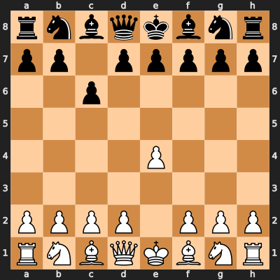
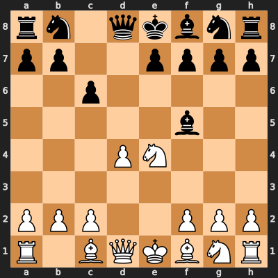
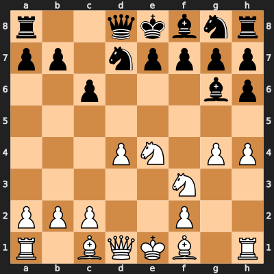
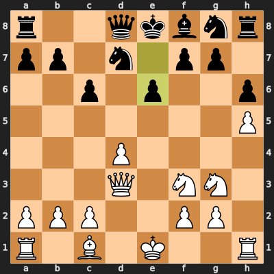
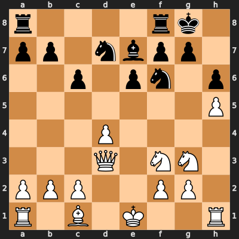

# The Black Repertoire: Caro-Kann Classical {#sec-black-repertoire}

## Overview

As Black, CounterLine plays the **Caro-Kann Defence** with the **Classical 4...Bf5 variation** — one of the most solid and respected defences in chess. Unlike the aggressive White repertoire, the Black repertoire is about *survival and solidity*. The goal is not to win in the opening but to reach a position where Black cannot realistically lose — and occasionally, where Black can win.

In testing, this line scored 53.75% against Stockfish 18 from the exit position, including **three Black wins and zero losses** across 20 games as Black.

::: {.callout-note}
## What to Remember
The Black repertoire is a fortress. Your job is to reach the exit position, develop your remaining pieces naturally (...Ngf6, ...Be7, ...O-O), and hold. The line was chosen because it was the only one in 14 candidates that never lost.
:::

## The Full Line

**1. e4 c6 2. d4 d5 3. Nc3 dxe4 4. Nxe4 Bf5 5. Ng3 Bg6 6. h4 h6 7. Nf3 Nd7 8. h5 Bh7 9. Bd3 Bxd3 10. Qxd3 e6**

This is 10 moves as Black (20 half-moves). Let us walk through each one.

## Move by Move

### 1. e4 c6 — The Caro-Kann Defence

{#fig-carokann-1c6 width=55%}

Black plays 1...c6, preparing to push ...d5 on the next move. Unlike 1...e5 (which fights for the centre directly) or 1...c5 (the aggressive Sicilian), the Caro-Kann is strategic and solid. Black says: "I will challenge your centre, but on my own terms."

**Why the Caro-Kann?** In the 28-candidate screening, Black defences that fought for immediate equality (Sicilian Najdorf, King's Indian) tended to lose more than they won — White's first-move advantage is real. The Caro-Kann was the only defence that scored above 50% with zero losses.

### 2. d4 d5

The standard continuation. Both sides have pawns in the centre. White's pawn on e4 is challenged.

### 3. Nc3 dxe4 4. Nxe4 — Entering the Classical

Black captures on e4, and White recaptures with the knight. The knight on e4 is powerfully placed but will need to be dealt with.

### 4...Bf5 — The Classical Move

{#fig-carokann-4bf5 width=55%}

This is the defining move of the Classical Caro-Kann. Black develops the bishop *outside* the pawn chain before playing ...e6. This is crucial — in many other Caro-Kann lines, the light-squared bishop gets trapped behind the e6 pawn. By playing ...Bf5 now, Black solves the "bad bishop" problem before it even starts.

### 5. Ng3 Bg6

White attacks the bishop with the knight. Black retreats to g6, where the bishop is still active on the b1-h7 diagonal.

### 6. h4 h6

White pushes the h-pawn, threating h5 to trap Black's bishop. Black replies with ...h6, giving the bishop a retreat square on h7 if needed. The move ...h6 also takes the g5 square away from White's knight and bishop.

### 7. Nf3 Nd7

White develops the second knight. Black develops the queen's knight to d7.

::: {.callout-note}
## Why ...Nd7 Instead of ...Nf6?
In the Classical Caro-Kann, 7...Nd7 is the main line. The knight on d7 supports future ...e6 and ...Ngf6, and keeps the c-file clear for the queen. Playing 7...Nf6 directly is also possible but leads to different structures.
:::

### 8. h5 Bh7

{#fig-carokann-tabiya width=55%}

White pushes h5, and Black retreats the bishop to h7. The bishop is now passive, but this is by design: it has already done its job (avoiding being locked behind the e6 pawn), and Black will exchange it on the next few moves.

### 9. Bd3 Bxd3 10. Qxd3

White develops the bishop to d3, and Black immediately trades it off. This exchange is highly favourable for Black: the light-squared bishops come off the board, eliminating one of White's most active pieces, and Black's pawn structure remains intact.

::: {.callout-note}
## Why SF18 Struggles Here
After the bishop exchange, the position is close to equal. Stockfish 18's neural network recognises this — its evaluation is typically around +0.3 to +0.5 for White, which in practice often means a draw. The CounterLine specialist has seen 7,893 positions in this structure and knows which specific moves lead to the best outcomes. This empirical knowledge makes the difference.
:::

### 10...e6 — The Exit Position

{#fig-carokann-exit width=55%}

We have arrived at the exit position. Black has played 10 moves and achieved:

**Black's strengths:**

- **Solid pawn chain**: c6-e6 is compact and hard to attack
- **No bad bishop**: the light-squared bishops are exchanged
- **Clear development plan**: ...Ngf6, ...Be7, ...O-O
- **Flexible knight**: Nd7 can go to f6, b6, or e5
- **Queen is not committed**: still on d8 with options

**White's assets:**

- **Space advantage**: pawns on d4 and h5 control squares
- **Two knights on active squares**: Nf3 and Ng3
- **Semi-open h-file**: h5 has pushed Black's pawn structure

## Plans After the Exit

### Plan A: Complete Development — ...Ngf6, ...Be7, ...O-O

This is the most common and most important plan. After the exit, Black plays:

1. **...Ngf6** — Develop the knight to its natural square
2. **...Be7** — Develop the bishop (not ...Bd6, which blocks the d-file)
3. **...O-O** — Castle kingside for safety

{#fig-carokann-fortress width=55%}

After these three moves, Black's position is rock-solid. The king is safely castled, both knights are developed, the bishop covers the kingside, and the rooks can connect.

### Plan B: The ...c5 Break

Once developed, Black's main strategic idea is the pawn break **...c5**, challenging White's d4 pawn. If White captures (dxc5), Black recaptures with the knight (...Nxc5) and gets active piece play. If White does not capture, Black has equalised the centre.

**Timing is important.** Play ...c5 only after you are fully developed. Premature ...c5 can backfire if your pieces are not coordinated.

### Plan C: Rook Play on the d-File

After castling, Black's rooks can go to d8 (or even b8 for the b-file). The d-file is semi-open after the centre exchanges, and planting a rook on d8 creates pressure against White's d4 pawn.

### Plan D: Play for ...Nd5

In some positions after the centre exchange, Black can reroute a knight to d5 — an ideal outpost in the Caro-Kann. The knight on d5 is centrally placed, cannot be chased by pawns (the c-pawn is on c6), and controls key squares.

::: {.callout-important}
## Key Practical Point
Do not try to win in the opening. The Caro-Kann exit is slightly better for White on paper. Your goal is to develop all your pieces, castle, and reach a position where draws are the natural outcome. The CounterLine specialist scored 53.75% by *not losing* and occasionally finding wins in the endgame. Patience is your weapon.
:::

## Summary

| Move | Black Plays | Purpose |
|------|-------------|---------|
| 1 | ...c6 | Caro-Kann — prepare ...d5 |
| 2 | ...d5 | Challenge the centre |
| 3 | ...dxe4 | Enter the Classical |
| 4 | ...Bf5 | Develop bishop outside the chain |
| 5 | ...Bg6 | Retreat from the knight |
| 6 | ...h6 | Prevent bishop trapping, control g5 |
| 7 | ...Nd7 | Develop knight, support ...e6 |
| 8 | ...Bh7 | Retreat — prepare exchange |
| 9 | ...Bxd3 | Exchange bishops — equalise |
| 10 | ...e6 | Reach the exit position |

: Black repertoire move summary {#tbl-black-moves}
