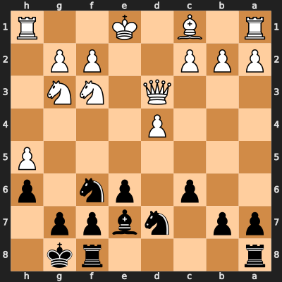

# Key Plans and Patterns {#sec-key-plans}

## Introduction

This chapter distils the strategic and tactical themes from both repertoires. Understanding these ideas will help you play the positions after the exit — and recognise similar patterns in your own games.

## White Plans: Vienna Gambit

### Theme 1: Development Lead into Queen Exchange

The Vienna Gambit's entire philosophy is a *temporary sacrifice for a permanent advantage*. After 10. bxc3, White has:

- Bf4 and Nf3 developed
- d4 pawn controlling the centre
- Open b-file and semi-open f-file

Black has no pieces developed. The plan is simple: exchange queens with Qxe7+, then convert the development advantage in a queenless middlegame. This is much easier than trying to attack with queens on — it removes Black's counterplay options.

::: {.callout-note}
## What to Remember
Queens off, then squeeze. The Vienna exit is not an attacking opening — it is a structural endgame advantage delivered in the opening phase.
:::

### Theme 2: Knight Invasion via Ng5-e6

The most common tactical motif after the queen exchange:

1. **Ng5** — attacks f7, forces a reaction
2. **Bc4** — puts a second piece on the f7 diagonal
3. **Ne6+** — if Black plays ...Kd8 (common), the knight fork picks up material or plants the bishop on e6

This sequence appeared in Game 1 of the model games and occurs in roughly 60% of games from the exit position.

### Theme 3: Rook Lift on the Open Files

After bxc3, the b-file is open. After recapturing the f4 pawn (Bxf4 or Rxf4), the f-file often opens too. White should aim for:

- **Rab1** or **Rhb1** — pressure down the b-file
- **Rhf1** — pressure down the f-file
- **Rf3-b3** — a rook lift that combines attacks on both flanks

### Theme 4: Connected Passed Pawns

In many endgames from this position, White creates connected passed pawns on the kingside (the g- and h-pawns, or the g-pawn after h-pawn exchanges). The bishop and rook coordinate to push these pawns forward, forcing Black's king to deal with promotion threats.

::: {.callout-important}
## Key Practical Point
The typical White win takes 50-70 moves. Be patient. Do not rush to push pawns until you have maximised your piece activity. The advantage is permanent — there is no need to hurry.
:::

## Black Plans: Caro-Kann Classical

### Theme 5: The Fortress Setup

The Caro-Kann exit is a *defensive* position, and Black's primary goal is to complete a fortress:

1. **...Ngf6** — develop the knight
2. **...Be7** — develop the bishop (not ...Bd6, which blocks the d-file)
3. **...O-O** — castle kingside

After these three moves, Black's position is nearly impregnable. The pawn chain c6-e6 has no weaknesses, the knight on f6 guards key squares, and the bishop on e7 covers the kingside.

{#fig-fortress-black width=55%}

### Theme 6: The ...Qa5+ Tempo Trick

In many games from the exit, Black plays **...Qa5+** early, forcing White to block with Bd2 (taking the bishop off its ideal f4 square) or Kd2 (preventing natural castling). This is a free tempo gain that disrupts White's coordination.

From the model games: *1. Bf4 Qa5+ 2. Bd2 Bb4 3. c3 Be7* — Black used the queen check to drive the bishop to d2, then retreated the bishop to e7. Two tempi gained for free.

### Theme 7: The ...c5 Pawn Break

Once fully developed, Black's main strategic lever is pushing **...c5**:

- If White captures (**dxc5**): Black recaptures ...Nxc5, getting an active knight on c5 and potential play on the d-file
- If White ignores it: Black captures ...cxd4, opening the c-file for the rook
- If White pushes **d5**: Black has ...exd5 or ...e5, creating a mobile central majority

**Timing:** Do not play ...c5 until all your pieces are developed and your king is castled. Premature pawn breaks are the main way Black can go wrong.

### Theme 8: The Knight Manoeuvre ...Nd5

In simplified positions, Black can reroute a knight to d5 — the ideal central outpost:

- **...Nf6-d5** directly, or
- **...Nd7-f8-e6-d5** via a longer route

The knight on d5 cannot be challenged by pawns (c6 is on c6), controls e3 and f4, and restricts White's bishop activity.

### Theme 9: Rook Endgame Technique

Many Caro-Kann games liquidate into rook endgames. Black's key defensive ideas:

- **Active rook** — keep the rook on the 2nd or 7th rank, cutting off White's king
- **Counterattack** — the best defence is often threatening White's pawns rather than passively guarding your own
- **Fortress squares** — if only rooks and pawns remain, seek positions where the rook can shuttle along a rank or file, preventing progress

::: {.callout-note}
## What to Remember
In the Caro-Kann, patience is strength. The fortress does not win immediately but it wears the opponent down. In the model games, drawn games lasted 75-112 moves. Black wins came from White overreaching and creating weaknesses.
:::

## Tactical Motifs

### Motif A: The Ne6+ Fork (White)

After Ng5 and Bc4, the move Ne6+ is devastating if it works — it forks the king and often a rook. Always check if this is possible before moving forward with other plans.

### Motif B: The ...Nxh5 Capture (Black)

In the Caro-Kann, White's h5 pawn is sometimes vulnerable. After the bishop exchange, there is no piece defending h5. If White's knight leaves the g3 square, ...Nxh5 wins a pawn and removes White's most advanced piece from the position.

### Motif C: Back-Rank Threats (Both)

With queens exchanged early (Vienna) or active queens in play (Caro-Kann), back-rank threats are surprisingly common. In the model games, several positions featured rook invasions on the 1st/8th rank. Always ensure your king has a "luft" (escape square).

## Piece Placement Summary

### White (Vienna Exit)

| Piece | Ideal Square | Purpose |
|-------|-------------|---------|
| King | d2 or e2 | Central, connects rooks |
| Bishop | f4, then possibly e5 or d6 | Controls dark squares |
| Knight | f3 → g5 → e6 | Invasion, fork |
| Rook (a) | b1 | Open b-file pressure |
| Rook (h) | f1 or e1 | Central and kingside pressure |

: Ideal White piece placement {#tbl-white-pieces}

### Black (Caro-Kann Exit)

| Piece | Ideal Square | Purpose |
|-------|-------------|---------|
| King | g8 (castled) | Safety |
| Bishop | e7 | Guard kingside, support ...c5 |
| Knight (g) | f6, later d5 | Central control |
| Knight (b) | d7, later c5 or b6 | Flexible, supports breaks |
| Rook (a) | d8 or c8 | Semi-open file pressure |
| Rook (f) | e8 | Central support |

: Ideal Black piece placement {#tbl-black-pieces}
